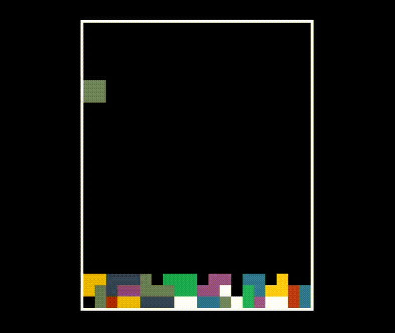

# uefi_tetris

# Build
```
$ Specially thanks to https://github.com/eternalinsomnia/uefi_tetris 
$ first of all using main.c and MakeFile
$ use command :  
$ make
```
# Launch
## QEMU
```
$ apt install qemu ovmf gnu-efi
$ first make sure where is bootable flash mounted
$ format to fat32
$ make a folder as a top named EFI
$ in that folder mae another folder called BOOT
$ in that you must have a file named BOOTX64.efi
$ now based on last documantaion copy OVMF.fd in a folder
$ in that folder build a test.img
$ use command :
sudo qemu-system-x86_64 -L . --bios ~/Documents/OVMF.fd -hda test.img -hdb /dev/sdd1 -boot d -m 256
$ be carefull /dev/sdd1 means where youre flash mouted
$ finish :)
```
## Create a bootable usb drive
```
$ mkfs.vfat -F32 /dev/sdx
$ mkdir -p mnt
$ mount /dev/sdx mnt/
$ mkdir -p mnt/EFI/BOOT
$ cp tetris.efi mnt/EFI/BOOT/BOOTx64.EFI
$ umount mnt 
$ mount /dev/sdx mnt/
```
## Run sequence:
modify main c file
$ make
$ 